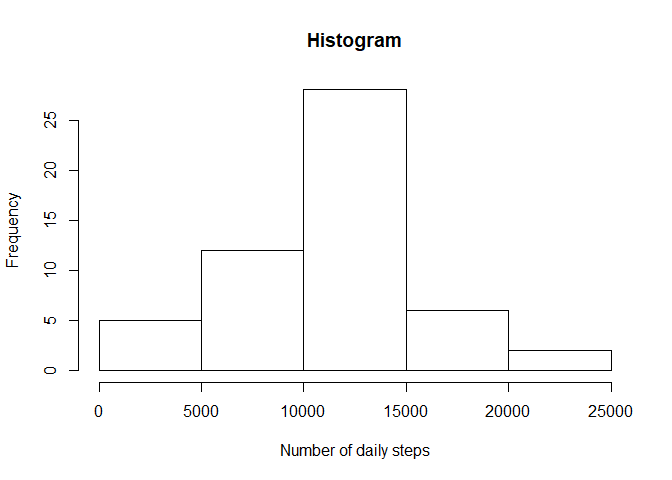
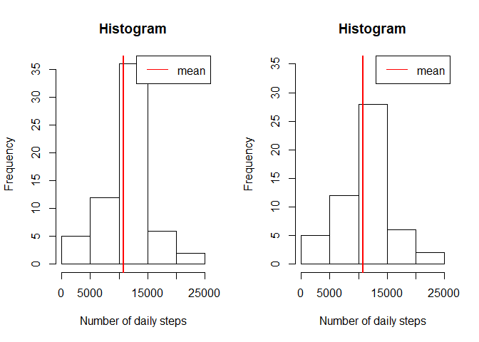
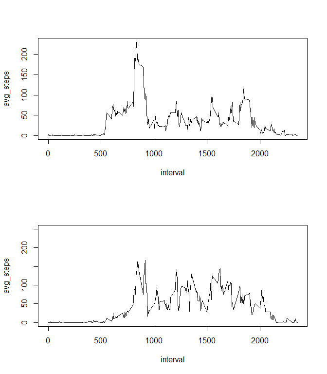

# Reproducible Research: Peer Assessment 1
David Conejero  
22 de julio de 2017  


## Introduction

This is an R Markdown document for the 1st Assignment in Reproducible Research course at Coursera.
On this assignment I will create a **single R markdown** document that can be processed by **knitr**. To answer the different requirements, it will follow the same structure than the assignment instructions.

The only exception is that I did not Fork/Clone the [GitHub repository created for this
assignment](http://github.com/rdpeng/RepData_PeerAssessment1), but I started from scratch.
However the repository contains

1) Data
2) Readme
3) R markdown file (this)
4) figures folder with the figures shown on this report


## Data

The data for this assignment can be downloaded from the course web
site. But in fact, it has been also included in the repository.

* Dataset: [Activity monitoring data](https://d396qusza40orc.cloudfront.net/repdata%2Fdata%2Factivity.zip) [52K]

The variables included in this dataset are:

* **steps**: Number of steps taking in a 5-minute interval (missing
    values are coded as `NA`)

* **date**: The date on which the measurement was taken in YYYY-MM-DD
    format

* **interval**: Identifier for the 5-minute interval in which
    measurement was taken


## Assignment

### Loading and preprocessing the data

Show any code that is needed to

1. Load the data (i.e. `read.csv()`)


```r
activity<-read.csv("activity.csv", as.is = TRUE, dec=".", na.strings = "NA")
```

### What is mean total number of steps taken per day?

For this part of the assignment, the missing values in the dataset are ignored.

1. Make a histogram of the total number of steps taken each day


```r
hist_sum<-tapply(activity$steps, activity$date, sum)

hist(hist_sum, main="Histogram", xlab="Number of daily steps")
```

<!-- -->

2. Calculate and report the **mean** and **median** total number of steps taken per day


```r
mean(hist_sum, na.rm=TRUE)
```

```
## [1] 10766.19
```

```r
quantile(hist_sum, na.rm=TRUE)
```

```
##    0%   25%   50%   75%  100% 
##    41  8841 10765 13294 21194
```

```r
hist(hist_sum, main="Histogram", xlab="Number of daily steps")
abline(v=mean(hist_sum, na.rm=TRUE), col="red", lwd=2)
legend("topright", legend = c("mean"), col=c("red"), lty=c(1))
```

<!-- -->

### What is the average daily activity pattern?

1. Make a time series plot (i.e. `type = "l"`) of the 5-minute interval (x-axis)
and the average number of steps taken, averaged across all days (y-axis)


```r
library(dplyr)

a_by_interval<-activity %>% 
               group_by(interval) %>% 
               summarise(avg_steps=mean(steps, na.rm=T))

with(a_by_interval, plot(avg_steps ~ interval, type="l"))
```

<!-- -->

2. Which 5-minute interval, on average across all the days in the dataset, 
contains the maximum number of steps?

The average maximum number of steps is:

```r
max(a_by_interval$avg_steps)
```

```
## [1] 206.1698
```

And it is achieved at interval:

```r
pos_max_interval<-which.max(a_by_interval$avg_steps)
a_by_interval[pos_max_interval,"interval"][[1]]
```

```
## [1] 835
```

### Imputing missing values

Note that there are a number of days/intervals where there are missing
values (coded as `NA`). The presence of missing days may introduce
bias into some calculations or summaries of the data.

1. Calculate and report the total number of missing values in the dataset (i.e. the total number of rows with `NA`s)


```r
bad<-is.na(activity$steps)
sum(bad)
```

```
## [1] 2304
```

2. Devise a strategy for filling in all of the missing values in the dataset. The strategy does not need to be sophisticated. 

I decided to assign the mean for that 5-minute interval to each NA value.

3. Create a new dataset that is equal to the original dataset but with the missing data filled in.


```r
new_activity<-merge(activity,a_by_interval, by="interval")
new_activity<-mutate(new_activity,
                     steps=coalesce(steps,as.integer(round(avg_steps))))
```

4. Make a histogram of the total number of steps taken each day and Calculate and report the **mean** and **median** total number of steps taken per day. Do these values differ from the estimates from the first part of the assignment? What is the impact of imputing missing data on the estimates of the total daily number of steps?

New **Mean** and **Median** are very similar to the previous one

```r
new_hist_sum<-tapply(new_activity$steps, new_activity$date, sum)

mean(new_hist_sum, na.rm=TRUE)
```

```
## [1] 10765.64
```

```r
quantile(new_hist_sum, na.rm=TRUE)
```

```
##    0%   25%   50%   75%  100% 
##    41  9819 10762 12811 21194
```

And the main impact on the Histogram is that the average interval increases. As
it can be seen compared to the previous histogram.


```r
par(mfrow=c(1,2))
hist(new_hist_sum, main="Histogram", xlab="Number of daily steps")
legend("topright", legend = c("mean"), col=c("red"), lty=c(1))
abline(v=mean(new_hist_sum, na.rm=TRUE), col="red", lwd=2)
hist(hist_sum, ylim=c(0,35), main="Histogram", xlab="Number of daily steps")
abline(v=mean(hist_sum, na.rm=TRUE), col="red", lwd=2)
legend("topright", legend = c("mean"), col=c("red"), lty=c(1))
```

<!-- -->

### Are there differences in activity patterns between weekdays and weekends?


1. Create a new factor variable in the dataset with two levels -- "weekday" and "weekend" indicating whether a given date is a weekday or weekend day.


```r
new_activity<-mutate(new_activity, weekday=weekdays(as.Date(new_activity$date)))
new_activity<-mutate(new_activity, weekend= if_else(weekday=="sábado" | weekday=="domingo", TRUE, FALSE))
```


1. Make a panel plot containing a time series plot (i.e. `type = "l"`) of the 5-minute interval (x-axis) and the average number of steps taken, averaged across all weekday days or weekend days (y-axis). The plot should look something like the following, which was created using **simulated data**:

First of all we need to get the information on the average of steps by interval accross all days.


```r
activity_weekend<-filter(new_activity, weekend==TRUE)
activity_weekday<-filter(new_activity, weekend==FALSE)

a_by_interval_weekday<-activity_weekday %>% 
        group_by(interval) %>% 
        summarise(avg_steps=mean(steps, na.rm=T))
a_by_interval_weekend<-activity_weekend %>% 
        group_by(interval) %>% 
        summarise(avg_steps=mean(steps, na.rm=T))
```

And then plot it to be able to compare the behaviour weekend vs weekday

```r
par(mfrow=c(2,1))
with(a_by_interval_weekday, plot(avg_steps ~ interval, type="l"))
with(a_by_interval_weekend, plot(avg_steps ~ interval, type="l", ylim=c(0,250)))
```

<!-- -->
